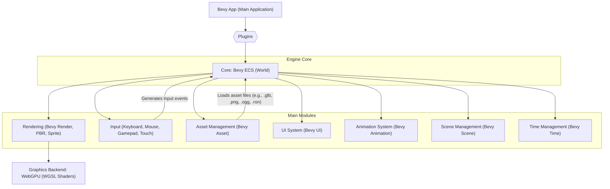

# 🚀 Bevy Engine

<p align="center"></p>

## Short Description
Bevy is a refreshingly simple and powerful data-driven game engine built in Rust. Designed for peak performance, extreme modularity, and rapid development, Bevy empowers developers to create ambitious 2D and 3D games and interactive applications with ease. Its innovative Entity Component System (ECS) architecture, coupled with a flexible plugin system, provides an unparalleled foundation for building robust and scalable projects across multiple platforms.

## ✨ Key Features
*   **Data-Driven ECS Core:** A highly performant and flexible Entity Component System (ECS) architecture (`bevy_ecs`) forms the backbone, enabling modular and efficient game logic.
*   **Comprehensive Rendering:** State-of-the-art 2D and 3D rendering capabilities (`bevy_render`, `bevy_sprite`, `bevy_pbr`) powered by WebGPU (WGSL shaders), including advanced features like Bloom, Depth of Field, Screen Space Reflections (SSR), Volumetric Fog, and Tonemapping (`bevy_core_pipeline`).
*   **Flexible Asset Management:** Robust asset loading and management (`bevy_asset`) for various file types, including glTF models, images, audio, and custom asset formats, with support for hot-reloading.
*   **Dynamic UI System:** A powerful and extensible UI framework (`bevy_ui`, `bevy_feathers`) supporting flexible layouts, gradients, box shadows, and responsive design, enhanced with accessibility features (`bevy_a11y`) and directional navigation (`bevy_input_focus`).
*   **Advanced Animation:** Comprehensive animation features (`bevy_animation`) for skinned meshes, morph targets, and property animation, complete with animation graphs for complex state management.
*   **Cross-Platform Compatibility:** Write once, deploy anywhere! Bevy supports desktop (Windows, macOS, Linux), WebAssembly (Wasm), and Android platforms.
*   **Intuitive Input Handling:** Streamlined input processing for keyboards, mice, gamepads (`bevy_input`, `bevy_gilrs`), and touch events.
*   **Built-in Diagnostics & Dev Tools:** Essential tools for performance monitoring (FPS overlay), debugging, and asset inspection (`bevy_dev_tools`, `bevy_diagnostic`).
*   **Modular Plugin System:** Easily extend and customize engine functionality with a lightweight and powerful plugin architecture (`bevy_app`).
*   **Scene & Resource Management:** Tools for defining, loading, and managing scenes (`bevy_scene`) and global resources (`bevy_ecs`).

## Who is this for?
Bevy is perfect for Rustaceans who want to build:
*   **Indie Games:** Rapid prototyping and full game development for 2D and 3D titles.
*   **Interactive Applications:** High-performance tools, simulations, and real-time visualizations.
*   **Engine Developers:** A modular foundation for building custom engine features and experimenting with graphics.
*   **Performance Enthusiasts:** Leveraging Rust's safety and speed, Bevy is built for optimal performance.

## Technology Stack & Architecture
Bevy is meticulously crafted in **Rust**, taking full advantage of its performance, concurrency, and memory safety. The rendering backend is built on **WebGPU** (using WGSL for shaders) for modern, cross-platform graphics. Key architectural highlights include:

*   **Entity Component System (ECS):** The core design principle, promoting data-oriented design and parallel execution.
*   **Plugin-Driven Architecture:** The engine functionality is composed of many small, independent plugins, enabling modularity and customizability.
*   **Winit:** Handles windowing and low-level input on desktop and web platforms.
*   **Android NDK:** Provides mobile support for Android devices.

## 📊 Architecture & Database Schema
Bevy's architecture is a plugin-driven ECS (Entity Component System) framework. Below is a high-level overview of how core modules interoperate:



## ⚡ Quick Start Guide
To get started with Bevy:

1.  **Install Rust:** If you don't have Rust installed, follow the instructions at [rustup.rs](https://rustup.rs/).
2.  **Create a New Project:**
    ```bash
    cargo new my_bevy_project
    cd my_bevy_project
    ```
3.  **Add Bevy as a Dependency:** Edit your `Cargo.toml` to include `bevy` (and any other features you need, like `bevy_asset` for asset loading or `bevy_gilrs` for gamepad support):
    ```toml
    [dependencies]
    bevy = "0.13" # Or the latest version
    ```
4.  **Run an Example:** Bevy's examples directory contains many projects to help you learn. To run one:
    ```bash
    cargo run --release --example 3d_scene
    ```

For detailed instructions on setting up your development environment for specific platforms (like Linux dependencies or WASM builds), please refer to the `docs/` and `examples/` directories in the repository.

## 📜 License
Bevy is dual-licensed under both **MIT** and **Apache 2.0** licenses. You may choose either license to use the engine. See `LICENSE-MIT` and `LICENSE-APACHE` for full details.
