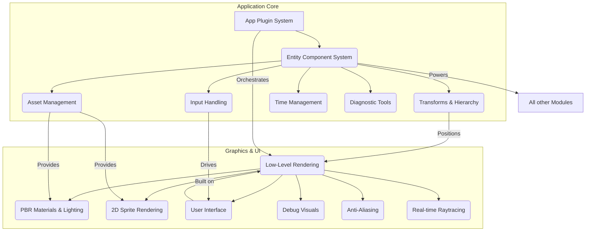

# 🚀 Bevy Engine

<p align="center"></p>

## Short Description
Bevy is a refreshingly simple and incredibly powerful data-driven game engine and application framework built in Rust. Designed for performance, modularity, and developer ergonomics, Bevy empowers you to create stunning 2D and 3D experiences with ease, from hyper-casual mobile games to complex simulations and desktop applications.

## ✨ Key Features
*   **Data-Driven ECS:** At its core, Bevy utilizes a custom, high-performance Entity Component System (ECS) for unparalleled flexibility, speed, and maintainability.
*   **Advanced 2D & 3D Rendering:** Leverage sophisticated rendering capabilities including Physically Based Rendering (PBR), dynamic shadows, post-processing effects, and an extensible render graph.
*   **Real-time Raytracing (Bevy Solari):** Explore cutting-edge graphics with experimental support for real-time global illumination and reflections.
*   **Modular & Extensible:** A flexible plugin system allows you to pick and choose features, or create your own, building exactly what your project needs.
*   **Intuitive UI System:** Construct responsive and interactive user interfaces with a powerful, declarative UI framework.
*   **Comprehensive Asset Management:** Seamlessly load and manage diverse assets such as 3D models (GLTF), textures, fonts, and audio files.
*   **Cross-Platform Deployment:** Target a wide array of platforms including Windows, macOS, Linux, WebAssembly, Android, and iOS.
*   **Rich Input Handling:** Out-of-the-box support for keyboard, mouse, gamepad, and touch inputs across all supported platforms.
*   **Robust Animation:** Bring your scenes to life with a versatile animation system capable of animating various properties and blending states.
*   **Debugging & Diagnostics:** Integrated tools like customizable FPS overlays, frame time graphs, and gizmos for efficient development and performance analysis.
*   **Type Reflection:** Dynamic type information enables powerful serialization, hot-reloading, and inspector tools.
*   **Asynchronous Task Execution:** Efficiently offload heavy computations and I/O operations without blocking the main thread.

## Who is this for?
Bevy is crafted for ambitious developers who demand performance without sacrificing developer experience. Whether you're building a hyper-casual mobile game, a complex 3D simulation, or a demanding desktop application, Bevy's modular and extensible design makes it an ideal choice. It particularly shines for Rust developers looking for a native, data-driven framework with state-of-the-art rendering features and a vibrant, growing ecosystem.

## Technology Stack & Architecture
At its core, Bevy is a Rust-native engine leveraging Rust's unparalleled performance and safety features. It utilizes `wgpu` for its cross-platform rendering backend, which translates to native APIs like Vulkan, Metal, DirectX 12, and OpenGL ES. The primary shader language used is WGSL (WebGPU Shading Language). The entire framework is built around a custom, high-performance Entity Component System (ECS), ensuring optimal data locality and parallelism. A flexible plugin system allows developers to build complex applications by composing various modular crates, fostering a highly scalable and maintainable architecture.

## 📊 Architecture & Database Schema
Bevy's architecture revolves around its incredibly efficient and highly parallelizable **Entity Component System (ECS)**. This design pattern enables scalable and maintainable code by separating data (Components) from behavior (Systems) that operate on generic data containers (Entities). The engine processes data through various **Schedules** (Startup, Update, FixedUpdate), handling **Input**, updating **Transforms**, managing **Assets**, and orchestrating the **Rendering Pipeline**. The modularity extends to specialized crates like `bevy_pbr` for realistic materials, `bevy_solari` for advanced raytracing, and `bevy_ui` for building interactive user interfaces. This interconnected system ensures optimal performance and flexibility.



## ⚡ Quick Start Guide
Dive into Bevy development with these simple steps. Ensure you have Rust and Cargo installed from [rustup.rs](https://rustup.rs/).

```bash
# Clone the repository
git clone https://github.com/grewal16/bevy.git
cd bevy

# Run a basic 3D scene example (recommended for a first look)
cargo run --release --example 3d_scene

# For a 2D example
cargo run --release --example 2d_shapes

# For an interactive UI example
cargo run --release --example ui_full
```
Explore the `examples/` directory for more demos and learning resources!

## 📜 License
This project is dual-licensed under both the [Apache 2.0 License](LICENSE-APACHE) and the [MIT License](LICENSE-MIT). You may choose either license to govern your use of this project.
