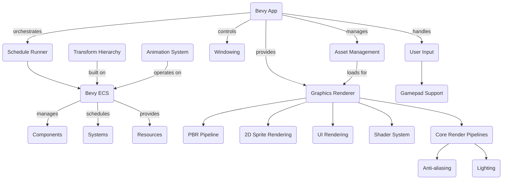

# 🚀 Bevy Engine

<p align="center"></p>

## Short Description
Bevy is a refreshingly simple and powerful data-driven game engine built in Rust. It's designed for maximum expressiveness, performance, and modularity, empowering developers to create a wide range of 2D and 3D applications and games with ease and efficiency. With a flexible Entity Component System (ECS) at its core, Bevy champions a "just enough engine" philosophy, allowing you to choose exactly what you need and replace what you don't.

## ✨ Key Features
*   **Data-Driven ECS Architecture**: Leverage a highly performant and parallelizable Entity Component System for elegant game logic and scalable designs.
*   **2D & 3D Rendering**: Comprehensive capabilities for both 2D sprites and complex 3D scenes, including Physically Based Rendering (PBR).
*   **Cross-Platform Support**: Develop once and deploy across Windows, macOS, Linux, Web (WASM), and Android, with ongoing iOS support.
*   **Flexible Asset Management**: An intuitive system for loading, managing, and hot-reloading game assets like textures, models, and sounds.
*   **Modern Graphics Features**: Includes advanced rendering techniques such as Bloom, Screen Space Ambient Occlusion (SSAO), Screen Space Reflections (SSR), Volumetric Fog, Depth of Field, Tonemapping, and various Anti-aliasing solutions (FXAA, SMAA, TAA, DLSS).
*   **Declarative UI System**: Build dynamic user interfaces with a flexible, reactive UI framework based on standard web layout principles.
*   **Powerful Animation System**: Support for skeletal animation, morph targets, and advanced animation graphs.
*   **Responsive Input Handling**: Integrated support for keyboard, mouse, touch, and gamepad input via Gilrs.
*   **Modular Design**: Every component is a plugin, allowing you to easily swap out or add custom functionality.

## Who is this for?
Bevy is ideal for Rustaceans, game developers, hobbyists, and professional studios looking for a robust, performant, and highly customizable engine. If you value compile-time safety, a strong type system, and want to build performant games and interactive applications without fighting against opinionated engine design, Bevy is for you.

## Technology Stack & Architecture
*   **Language**: Rust
*   **Core**: Custom Bevy Entity Component System (ECS)
*   **Rendering Backend**: Powered by WGPU, enabling cross-platform graphics through Vulkan, Metal, DirectX 12, WebGPU, and OpenGL ES3.
*   **Windowing**: Leverages Winit for robust window management.
*   **UI Layout**: Utilizes Taffy (a Rust re-implementation of Yoga) for a powerful Flexbox-based layout system.
*   **Input**: Integrates `winit` for window input and `gilrs` for gamepad support.

## 📊 Architecture & Database Schema
The Bevy Engine is built around a highly modular, data-driven architecture. At its heart is the custom Entity Component System (ECS), which dictates how data (Components) and logic (Systems) interact with game entities. The `Bevy App` orchestrates the lifecycle, plugins, and core modules.



## ⚡ Quick Start Guide
To get started with Bevy, you'll need the Rust toolchain installed.

1.  **Install Rust:** If you don't have Rust installed, follow the instructions on the [official Rust website](https://www.rust-lang.org/tools/install).

2.  **Create a New Project:**
    ```bash
    cargo new my_bevy_game
    cd my_bevy_game
    ```

3.  **Add Bevy as a Dependency:** Open `Cargo.toml` and add the following to your `[dependencies]` section:
    ```toml
    [dependencies]
    bevy = "0.14" # Use the latest version
    ```
    For specific features, you can enable them:
    ```toml
    [dependencies]
    bevy = { version = "0.14", features = ["bevy_asset", "bevy_gltf", "bevy_winit"] }
    ```

4.  **Write Your First Bevy App:** Replace the contents of `src/main.rs` with a basic Bevy application:
    ```rust
    use bevy::prelude::*;

    fn main() {
        App::new()
            .add_plugins(DefaultPlugins)
            .add_systems(Startup, setup)
            .run();
    }

    fn setup(mut commands: Commands) {
        commands.spawn(Camera2dBundle::default());
        commands.spawn(SpriteBundle {
            sprite: Sprite {
                color: Color::rgb(0.25, 0.25, 0.75),
                custom_size: Some(Vec2::new(100.0, 100.0)),
                ..default()
            },
            ..default()
        });
        println!("Hello Bevy!");
    }
    ```

5.  **Run Your Application:**
    ```bash
    cargo run
    ```

6.  **Explore Examples:** Bevy comes with a rich set of examples showcasing various features. Run them to learn more:
    ```bash
    cargo run --example 3d_scene
    cargo run --example sprite_animation
    cargo run --example ui/button
    ```

## 📜 License

This project is dual-licensed under both [MIT License](./LICENSE-MIT) and [Apache License, Version 2.0](./LICENSE-APACHE). You may choose either license to use this software.