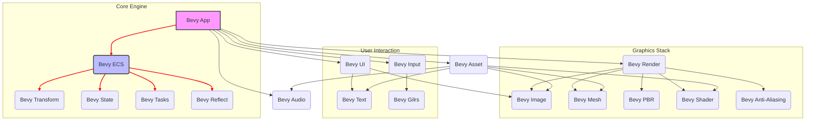

# 🚀 Bevy

<p align="center"></p>

## Short Description
Bevy is a refreshingly simple and powerful data-driven game engine built in Rust. It's designed for maximum productivity and performance, leveraging a modular, Entity-Component-System (ECS) architecture to enable rapid development of games and interactive applications across all major platforms. With its "code once, deploy everywhere" philosophy, Bevy empowers developers to bring their creative visions to life with ease.

## ✨ Key Features
*   **Data-Driven ECS:** At its core, Bevy utilizes a highly performant and flexible Entity-Component-System that makes architecting complex applications intuitive and efficient.
*   **2D & 3D Rendering:** Comprehensive support for both 2D sprites and advanced 3D graphics, including Physically Based Rendering (PBR), shaders, and GLTF model loading.
*   **Modular & Extensible:** The engine is composed of a collection of standalone crates, allowing developers to pick and choose the features they need, or extend them with custom functionality.
*   **Powerful Animation System:** Bring your characters and scenes to life with a robust animation framework, supporting skinned meshes, morph targets, and custom animation graphs.
*   **Flexible UI Framework:** Build responsive and interactive user interfaces with Bevy's declarative UI system, powered by a layout engine similar to Flexbox.
*   **Cross-Platform Deployment:** Target desktop (Windows, macOS, Linux), Android, and WebAssembly (WASM) out of the box.
*   **Developer Productivity:** Hot-reloading, comprehensive examples, and an active community streamline the development process.
*   **Asset Management:** Robust asset loading, processing, and hot-reloading capabilities to handle all your game resources efficiently.
*   **Advanced Graphics Pipeline:** Features like Anti-Aliasing (FXAA, SMAA, TAA), Depth of Field, Bloom, SSAO, SSR, Atmospheric Fog, and more, ensure stunning visuals.

## Who is this for?
Bevy is ideal for:
*   **Game Developers:** From indie studios to hobbyists, looking for a modern, high-performance engine.
*   **Interactive Application Creators:** Building simulations, visualizations, or other interactive experiences.
*   **Graphics Programmers:** Eager to dive deep into rendering pipelines and implement custom graphical effects.
*   **Rust Enthusiasts:** Those who want to build performant, reliable applications using the Rust programming language.
*   **Educators & Learners:** With its clean design and comprehensive examples, Bevy is a great platform for learning game development and ECS principles.

## Technology Stack & Architecture
*   **Core Language:** Rust
*   **Architecture:** Entity-Component-System (ECS)
*   **Rendering Backend:** WGPU (WebGPU implementation), providing cross-platform GPU access.
*   **Asset Formats:** GLTF, PNG, JPG, OGG, TTF, and custom asset types.
*   **UI Layout:** Flexbox-like layout engine powered by Taffy.
*   **Input Handling:** Integrates with OS-level input events for keyboard, mouse, touch, and gamepads (via `gilrs`).

## 📊 Architecture & Database Schema
Bevy's architecture is a plugin-driven, modular design centered around the Bevy ECS. Here's a simplified view of its core components and their relationships:



## ⚡ Quick Start Guide

To get started with Bevy, ensure you have Rust installed.
1.  **Clone the Repository:**
    ```bash
    git clone https://github.com/grewal16/bevy.git
    cd bevy
    ```
2.  **Run an Example:**
    Explore the `/examples` directory for various use cases. For a simple 3D scene:
    ```bash
    cargo run --example 3d_scene
    ```
3.  **Start a New Project:**
    ```bash
    cargo new my_bevy_project
    cd my_bevy_project
    ```
    Add Bevy as a dependency in your `Cargo.toml`:
    ```toml
    [dependencies]
    bevy = "0.13" # Or the latest version
    ```
    Create a basic `main.rs`:
    ```rust
    use bevy::prelude::*;

    fn main() {
        App::new()
            .add_plugins(DefaultPlugins)
            .add_systems(Startup, setup)
            .run();
    }

    fn setup(mut commands: Commands) {
        // Cameras
        commands.spawn(Camera3dBundle::default());
    }
    ```
4.  **Build and Run:**
    ```bash
    cargo run
    ```
    For faster compilation, especially during development, consider using `cargo run --release` or configuring `.cargo/config.toml` for optimized debug builds.

## 📜 License
Bevy is dual-licensed under:
*   [Apache License, Version 2.0](LICENSE-APACHE)
*   [MIT License](LICENSE-MIT)

You may choose either license to use this project.
