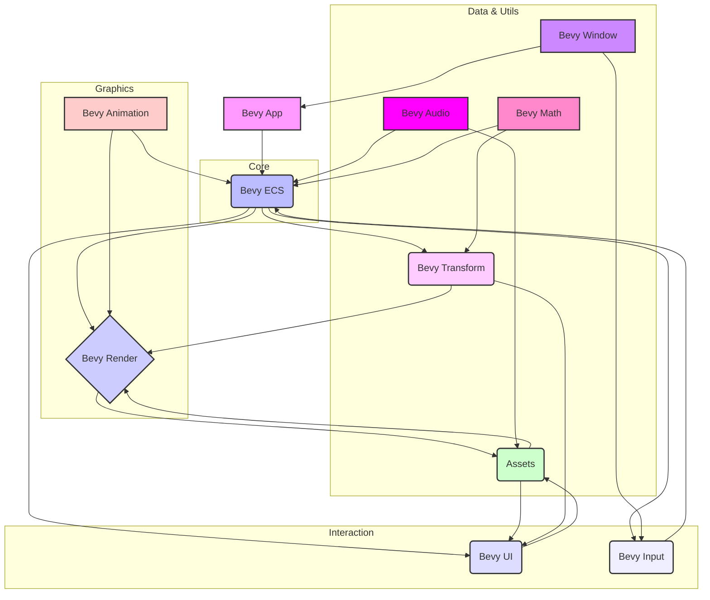

# 🚀 Bevy: The Refreshingly Simple Data-Driven Game Engine

Embark on your game development journey with Bevy, a modern, refreshingly simple, yet incredibly powerful data-driven game engine built in Rust. Bevy empowers developers to create ambitious 2D and 3D applications with an elegant Entity Component System (ECS) architecture, offering unparalleled performance and flexibility.

## Short Description
Bevy is an open-source game engine renowned for its expressiveness, modular design, and commitment to a data-driven paradigm. Leveraging the robustness and speed of Rust, it provides a comprehensive suite of tools for graphics, audio, input, animation, and UI development, ensuring your projects are both performant and enjoyable to build.

## ✨ Key Features

*   **Pure ECS Architecture:** At its core, Bevy champions a true Entity Component System, providing a clean, efficient, and highly parallelizable structure for managing game logic and data.
*   **Stunning 2D & 3D Rendering:** From physically-based rendering (PBR) and advanced lighting (directional, point, spot lights) to bloom, depth of field, screen space ambient occlusion (SSAO), screen space reflections (SSR), and volumetric fog, Bevy delivers visually rich experiences.
*   **Flexible Asset Pipeline:** A robust asset system supports diverse formats (GLTF, PNG, OGG, TTF, KTX2, RON) and features hot-reloading for rapid iteration, along with custom asset loaders for unique needs.
*   **Powerful Animation System:** Bring your worlds to life with skeletal animation, morph targets, and intuitive animation graphs, all enhanced by a rich set of easing functions.
*   **Responsive UI & Input:** Craft dynamic user interfaces with a flexible UI system, comprehensive input handling (keyboard, mouse, gamepad, touch, gestures), and built-in accessibility features.
*   **Cross-Platform by Design:** Develop once and deploy across multiple platforms, including desktop (Windows, macOS, Linux), Android, and WebAssembly (WASM), thanks to its WGPU-based rendering backend.
*   **High-Performance & Multithreaded:** Engineered for speed, Bevy fully utilizes modern CPUs with its parallel task system, ensuring smooth gameplay and efficient resource management.
*   **Extensible & Modular:** Bevy's plugin-driven architecture means you only include what you need, allowing for deep customization and effortless integration of third-party libraries.
*   **Developer-Friendly Tooling:** Integrated diagnostics, FPS overlays, and debugging utilities streamline development and optimization.

## Who is this for?

*   **Game Developers:** Whether you're an indie developer with a dream or part of a larger studio, Bevy's performance and productivity features make it an excellent choice for crafting compelling games.
*   **Engine & Tool Developers:** Its open-source nature, modular design, and low-level control make it an ideal foundation for building custom engines, specialized tools, or extending existing functionalities.
*   **Rust Enthusiasts:** For those passionate about Rust, Bevy offers a unique opportunity to build graphics-intensive applications in a safe, fast, and modern environment.
*   **Technical Artists & Researchers:** Explore advanced rendering techniques, procedural generation, and complex simulations with Bevy's flexible shader system and comprehensive math library.

## Technology Stack & Architecture

*   **Core Language:** Rust
*   **Primary Backend (Rendering):** WGPU (abstraction layer for Vulkan, Metal, DirectX 12, OpenGL ES, WebGPU)
*   **Architectural Pattern:** Entity Component System (ECS)
*   **Platform Abstraction:** Winit (for windowing and input on desktop), Android NDK (for mobile), WebAssembly (for web).
*   **Asset Management:** Custom asset pipeline, supporting common formats like GLTF, PNG, OGG, TTF.
*   **Serialization:** RON (Rusty Object Notation) is frequently used for asset and scene definitions.
*   **Concurrency:** Bevy's custom task system for efficient multithreaded processing.

## 📊 Architecture & Database Schema

The Bevy engine operates on a highly modular, data-driven architecture. The core principle is the Entity Component System (ECS), which decouples data (Components) from behavior (Systems) and provides a unique identifier (Entity) to group them. This enables parallel processing and flexible data structures.

Here's a simplified high-level view of how core modules interact:



## ⚡ Quick Start Guide

To get started with Bevy, ensure you have Rust installed. Then, follow these steps:

1.  **Create a new Rust project:**
    ```bash
    cargo new my_bevy_game
    cd my_bevy_game
    ```

2.  **Add Bevy as a dependency** in your `Cargo.toml`:
    ```toml
    [dependencies]
    bevy = "0.13" # Or the latest version
    ```

3.  **Write your first Bevy app** in `src/main.rs`:
    ```rust
    use bevy::prelude::*;

    fn main() {
        App::new()
            .add_plugins(DefaultPlugins)
            .add_systems(Startup, setup)
            .run();
    }

    fn setup(mut commands: Commands) {
        // Spawn a camera
        commands.spawn(Camera2dBundle::default());
        // You can add more entities here
        info!("Hello from Bevy!");
    }
    ```

4.  **Run your application (release mode recommended for performance):**
    ```bash
    cargo run --release
    ```

For more advanced examples, explore the `examples/` directory in the repository!

## 📜 License

This project is dual-licensed under both the **MIT License** and **Apache License, Version 2.0**.
You may choose which license to use at your discretion.

*   [LICENSE-MIT](LICENSE-MIT)
*   [LICENSE-APACHE](LICENSE-APACHE)
