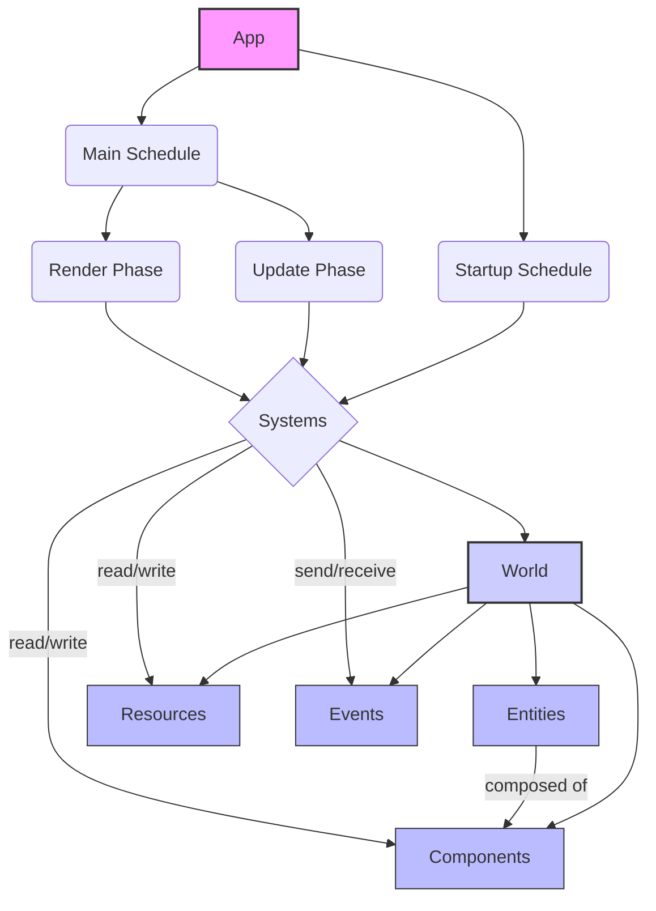

# 🚀 Bevy Engine

<p align="center"></p>

## Short Description
Bevy is a refreshingly simple and powerful data-driven game engine built in Rust. It's designed for maximum ergonomics, performance, and flexibility, empowering developers to create high-quality games and applications across multiple platforms, from desktop to web and mobile. With its modular ECS (Entity-Component-System) core, Bevy champions a "just the right amount of engine" philosophy, allowing you to easily swap, extend, or replace components to fit your exact needs.

## ✨ Key Features
*   **Data-Driven ECS Architecture:** At its core, Bevy leverages a highly performant and cache-friendly Entity-Component-System, making game logic clear, decoupled, and highly optimized.
*   **Cross-Platform Development:** Target Windows, macOS, Linux, WebAssembly (WASM), Android, and iOS with a single codebase, ensuring your creations reach a broad audience.
*   **2D & 3D Rendering:** Comprehensive support for both 2D and 3D graphics, including Physically Based Rendering (PBR), deferred rendering, dynamic lighting, shadows (PCSS), volumetric fog, SSR, SSAO, and various anti-aliasing techniques (FXAA, TAA, SMAA, DLSS).
*   **Flexible UI System:** Build responsive user interfaces with a declarative UI system, featuring layout, styling, and interaction capabilities, powered by `Taffy` for robust layout.
*   **Asset Management:** A powerful and extensible asset pipeline supporting custom loaders, hot-reloading for rapid iteration, and efficient handling of various media types including GLTF models, images, and audio.
*   **Animation System:** Drive complex character animations with animation graphs, morph targets, and skinned meshes, bringing your game worlds to life.
*   **Input Handling:** A unified input system for keyboard, mouse, gamepad (via Gilrs), and touch, providing a consistent experience across all supported platforms.
*   **Developer-Friendly Tools:** Integrated diagnostic tools, FPS overlays, gizmos for visual debugging, and robust logging to streamline your development workflow.
*   **Rust-Native Ergonomics:** Enjoy a code-driven, highly ergonomic development experience with Bevy's intuitive API and powerful Rust macros for type safety and compile-time checks.
*   **Async Task System:** Leverage multi-threaded task execution for heavy computations without blocking the main thread, maximizing performance and responsiveness.
*   **Scene Management:** Easily serialize, deserialize, and instantiate complex scenes, including full GLTF support.

## Who is this for?
Bevy is perfect for:
*   **Rust Developers** eager to build games or high-performance applications with a modern, ECS-first framework.
*   **Game Developers** seeking a performant, open-source engine that offers significant control and customization.
*   **Graphics Enthusiasts** who want to experiment with advanced rendering techniques like PBR, deferred rendering, and real-time global illumination (Solari).
*   **Innovators** looking for a modular engine that encourages building custom plugins and extending core functionality.

## Technology Stack & Architecture
*   **Language:** Rust
*   **Core Architectural Paradigm:** Entity-Component-System (ECS)
*   **Rendering Backend:** WGPU (WebGPU API abstraction for Vulkan, Metal, DirectX 12, OpenGL ES, WebGL2)
*   **Build System:** Cargo
*   **UI Layout Engine:** Taffy (for flexiblebox and grid layouts)
*   **Audio Playback:** Leverages system audio APIs (e.g., WASAPI, CoreAudio, ALSA, PulseAudio) via Rust audio crates.
*   **Gamepad Input:** Gilrs
*   **Window Management:** Winit

## 📊 Architecture & Database Schema
Bevy's architecture is built around a highly performant and flexible ECS model. Data is stored in a `World`, organized into `Entities` composed of `Components`, and manipulated by `Systems` orchestrated by `Schedules`.



## ⚡ Quick Start Guide

To get started with Bevy, ensure you have Rust and Cargo installed.

1.  **Create a new Rust project:**
    ```bash
    cargo new my_bevy_game
    cd my_bevy_game
    ```

2.  **Add Bevy as a dependency** in your `Cargo.toml`:
    ```toml
    [dependencies]
    bevy = "0.13" # Or the latest version
    ```

3.  **Add a minimal Bevy app** to `src/main.rs`:
    ```rust
    use bevy::prelude::*;

    fn main() {
        App::new()
            .add_plugins(DefaultPlugins)
            .add_systems(Startup, setup)
            .add_systems(Update, greet_people)
            .run();
    }

    fn setup(mut commands: Commands) {
        // Spawn a camera
        commands.spawn(Camera2dBundle::default());
        // Spawn a new entity with a Person component and a Name component
        commands.spawn((Person, Name("Alice".to_string())));
        commands.spawn((Person, Name("Bob".to_string())));
    }

    #[derive(Component)]
    struct Person;

    #[derive(Component)]
    struct Name(String);

    fn greet_people(query: Query<&Name, With<Person>>) {
        for name in query.iter() {
            println!("hello {}!", name.0);
        }
    }
    ```

4.  **Run your Bevy application:**
    ```bash
    cargo run
    ```

This simple application will print "hello Alice!" and "hello Bob!" to the console and open an empty window. Explore the `examples/` directory for more advanced use cases!

## 📜 License
This project is dual-licensed under both the Apache 2.0 License and the MIT License. You may choose either license to use this software.
*   [LICENSE-APACHE](./LICENSE-APACHE)
*   [LICENSE-MIT](./LICENSE-MIT)
