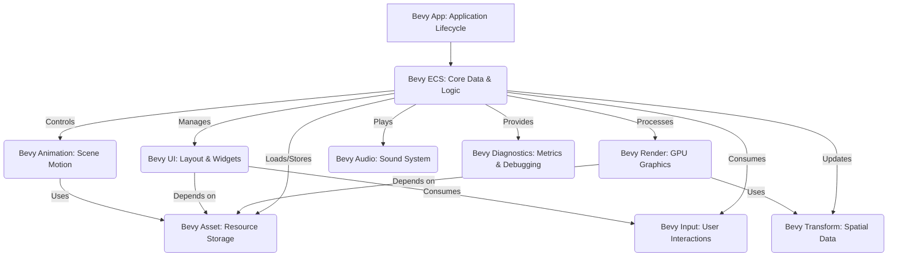

# 🚀 Bevy: A Data-Driven Game Engine

Welcome to **Bevy**, a refreshingly simple yet incredibly powerful data-driven game engine built in Rust. Bevy is designed for productivity and performance, offering a complete set of features for building 2D and 3D games across various platforms. Its modular architecture empowers developers with unparalleled flexibility and control.

<p align="center"></p>

## Short Description
Bevy is an open-source, modular, and performant game engine written in Rust. It champions an Entity-Component-System (ECS) architecture, enabling highly concurrent and scalable game logic. With its comprehensive feature set for rendering, UI, animation, audio, and more, Bevy is rapidly becoming a favorite for developers seeking modern game development tools in a safe, productive language.

## ✨ Key Features
*   **Entity-Component-System (ECS):** At its core, Bevy leverages a powerful and flexible ECS paradigm, offering a data-driven approach to game development that's inherently concurrent and highly scalable.
*   **Modern & Physically Based Rendering (PBR):** Experience stunning visuals with advanced rendering capabilities, including:
    *   Physically Based Rendering (PBR) materials.
    *   Deferred Rendering pipeline for complex scenes.
    *   Cutting-edge post-processing effects like Bloom, Screen Space Ambient Occlusion (SSAO), Screen Space Reflections (SSR), Depth of Field (DOF), and Motion Blur.
    *   Volumetric fog and dynamic lighting for immersive environments.
    *   Meshlet rendering for highly optimized geometry processing.
    *   Wireframe rendering for debugging and stylized visuals.
*   **Intuitive UI Framework:** Build responsive and accessible user interfaces with a flexible UI system, supporting gradients, box shadows, and comprehensive text rendering.
*   **Robust Animation System:** Bring your worlds to life with a versatile animation system featuring graph-based animations, morph targets, skinned meshes, and a wide array of easing functions.
*   **Immersive Audio:** Deliver rich sound experiences with 2D and 3D spatial audio, complete with fine-grained control over playback, pitch, and volume.
*   **Efficient Asset Management:** Seamlessly integrate game assets with features like hot-reloading for rapid iteration, custom asset loaders, and asynchronous asset pipelines, including support for compressed images.
*   **Comprehensive Input Handling:** Capture player interactions effortlessly with robust support for Keyboard, Mouse, Gamepad, and Touch inputs.
*   **Cross-Platform Support:** Develop once and deploy everywhere, with first-class support for desktop (Linux, Windows, macOS), Android, and WebAssembly (WASM).
*   **Developer-Friendly Tools:** Accelerate your workflow with built-in FPS overlays, detailed diagnostics, and integration with profiling tools.
*   **Advanced Math & Geometry:** A dedicated math library provides primitives for 2D/3D bounding, cubic splines, and various geometric shapes.
*   **Highly Modular Architecture:** Composed of numerous small, focused crates, allowing developers to pick and choose components, fostering reusability and tailored solutions.

## Who is this for?
Bevy is ideal for:
*   **Rust Game Developers:** Who desire a modern, high-performance, and type-safe engine.
*   **Indie Game Studios:** Looking for a powerful, open-source alternative with a growing community.
*   **Hobbyists:** Interested in game development with Rust, valuing ease of use and rapid prototyping.
*   **Researchers & Educators:** Seeking a transparent and extensible engine for graphics and game logic experimentation.
*   Anyone who values a highly concurrent, modular, and data-driven approach to software design.

## Technology Stack & Architecture
Bevy is predominantly written in **Rust**, leveraging its safety and performance guarantees. For graphics, it uses **WGPU**, a modern GPU API abstraction. 3D models are typically handled via the **GLTF** format, and windowing on desktop platforms is managed by **Winit**. Its architecture is built around a highly modular design, where core functionalities are provided as separate "crates" (Rust's package unit), all integrating seamlessly with the central Bevy App and ECS core.

## 📊 Architecture & Database Schema
Here's a high-level overview of Bevy's modular architecture:



## ⚡ Quick Start Guide
To get started with Bevy and explore its capabilities, follow these simple steps:

1.  **Clone the Repository:**
    ```bash
    git clone https://github.com/grewal16/bevy.git
    cd bevy
    ```
2.  **Run an Example:**
    Bevy comes with a rich set of examples. Try running one of the 3D examples:
    ```bash
    cargo run --example 3d_scene
    ```
    Or a 2D example:
    ```bash
    cargo run --example breakout
    ```
    To see a full list of available examples, run:
    ```bash
    cargo run --example --list
    ```
3.  **Build for Web (WASM):**
    First, ensure you have `wasm-pack` and `trunk` installed:
    ```bash
    cargo install wasm-pack trunk
    ```
    Then build and serve a WASM example:
    ```bash
    cd examples/wasm # Or any other example directory with WASM support
    trunk build --release
    trunk serve --open
    ```

## 📜 License
This project is dual-licensed under both **Apache License, Version 2.0** and **MIT License**. You may choose which license to use.

See [LICENSE-APACHE](./LICENSE-APACHE) and [LICENSE-MIT](./LICENSE-MIT) for full details.
