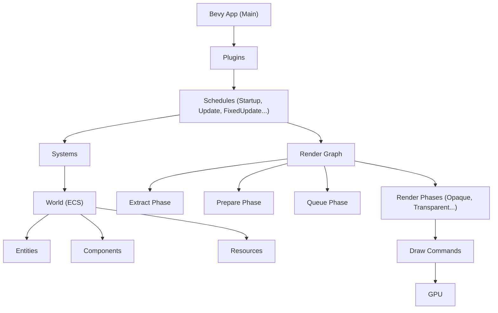

# 🚀 Bevy: The Refreshingly Simple Data-Driven Game Engine

<p align="center"></p>

<p align="center">
  <a href="https://github.com/grewal16/bevy/stargazers"></a>
  <a href="https://github.com/grewal16/bevy/network/members"></a>
  <a href="https://github.com/grewal16/bevy/issues"></a>
  <a href="./LICENSE-APACHE"></a>
</p>

## Short Description
Bevy is a blazing-fast, modular, and easy-to-use game engine built in Rust. Designed for ambitious developers, Bevy empowers you to create stunning 2D and 3D games and applications with its powerful, data-driven architecture and a clear, explicit API. Forget complexity; embrace productivity!

## 🛡️ Project Health & Status
Bevy is in active and robust development, boasting comprehensive CI/CD pipelines managed by GitHub Actions, extensive benchmarking (`benches/`), and rigorous testing (`tests/`). This commitment to quality ensures stability, performance, and a smooth development experience. Expect continuous improvements and a vibrant, supportive community.

## ✨ Key Features
*   **Entity Component System (ECS) Core:** A highly performant and flexible ECS drives the entire engine, enabling clean, modular, and scalable game logic.
*   **2D & 3D Rendering:** Craft immersive worlds with advanced rendering features including Physically Based Rendering (PBR), various lighting models (directional, point, spot, ambient), shadows, post-processing effects (bloom, SSAO, SSR, motion blur, depth of field), atmospheric fog, and skyboxes.
*   **Animation System:** Bring your creations to life with a powerful animation system supporting animation graphs, masks, and various easing functions for smooth, dynamic motion.
*   **Asset Management & Hot-Reloading:** Streamline your workflow with a robust asset pipeline that includes hot-reloading for rapid iteration and support for common formats like GLTF, PNG, OGG, HDR, and KTX2.
*   **Intuitive UI System:** Build responsive and dynamic user interfaces with a flexible UI toolkit, featuring robust layout controls, gradients, and custom widgets.
*   **Comprehensive Input Handling:** Support for keyboard, mouse, gamepad (via `gilrs`), and touch inputs ensures your games are accessible across various platforms.
*   **Cross-Platform Support:** Develop for desktop (Windows, macOS, Linux), Android, and WebAssembly, reaching a wide audience with minimal platform-specific code.
*   **Powerful Math Library:** Leverage a dedicated, optimized math library essential for game development, including bounding volumes, raycasting, splines, and geometric primitives.
*   **Developer Tools:** Integrated debugging and profiling tools, including a flexible gizmo system for visual debugging, enhance development efficiency.

## Who is this for?
Bevy is perfect for:
*   **Game Developers:** From indie studios to large teams looking for a modern, performant, and extensible engine.
*   **Interactive Application Developers:** Building simulations, UI-heavy tools, or any application requiring robust rendering and state management.
*   **Rust Enthusiasts:** Those eager to build high-performance applications leveraging the safety and speed of Rust.
*   **Engine Hackers:** Its modular design makes it an ideal playground for engine developers who want to contribute or customize deeply.

## Technology Stack & Architecture
Bevy is proudly built atop a cutting-edge, all-Rust technology stack, embracing modern paradigms for maximum performance and developer ergonomics.

*   **Core Language:** Rust
*   **Rendering Backend:** WebGPU (`wgsl` shaders, `wgpu_wrapper`)
*   **UI Layout:** Flexbox-inspired system (`crates/bevy_ui`)
*   **Input Handling:** `winit` for windowing, `gilrs` for gamepads
*   **Asset Serialization:** `.ron` (Rusty Object Notation)
*   **Asset Formats:** `.glb`, `.gltf`, `.ktx2`, `.png`, `.ogg`, `.hdr`, `.exr`, `.dds`, `.ttf`
*   **Build System:** Cargo

## 📊 Architecture & Database Schema
Bevy employs a highly modular and extensible architecture, centered around an Entity Component System (ECS) and a powerful, configurable Render Graph.


```mermaid
graph TD
    A["Bevy App (Main)"] --> B["Plugins"];
    B --> C["Schedules (Startup, Update, FixedUpdate...)"];
    C --> D["Systems"];
    D --> E["World (ECS)"];
    E --> F["Entities"];
    E --> G["Components"];
    E --> H["Resources"];
    C --> I["Render Graph"];
    I --> J["Extract Phase"];
    I --> K["Prepare Phase"];
    I --> L["Queue Phase"];
    I --> M["Render Phases (Opaque, Transparent...)"];
    M --> N["Draw Commands"];
    N --> O["GPU"];
```

## ⚙️ Configuration & Deployment
Bevy projects are configured using standard Rust `Cargo.toml` manifests, allowing for fine-grained control over dependencies and features. Build optimizations are often managed via `.cargo/config_fast_builds.toml`.

**Platform-Specific Deployment:**
*   **Desktop (Windows, macOS, Linux):** Standard `cargo build --release` with platform-specific dependencies (e.g., via `.github/actions/install-linux-deps`).
*   **Android:** Specialized tooling and project structures are provided in `examples/mobile/android_example` for seamless integration into Android projects.
*   **WebAssembly (Wasm):** Projects like `examples/wasm` demonstrate how to build and deploy Bevy applications for the web, often involving `wasm-bindgen` and a web server to serve assets.

## ⚡ Quick Start Guide
To get a Bevy project up and running:

1.  **Install Rust:** If you don't have Rust installed, follow the instructions on [rustup.rs](https://rustup.rs/).
2.  **Clone the repository:**
    ```bash
    git clone https://github.com/grewal16/bevy.git
    cd bevy
    ```
3.  **Run an example:** Navigate to an example directory and run it. For instance, a simple 3D scene:
    ```bash
    cargo run --example 3d_scene
    ```
    For a desktop-first experience with a new project, start with `cargo new --bin my_game` and add `bevy = "0.13"` (or the latest version) to your `Cargo.toml`.

For detailed platform-specific setup or advanced configurations, refer to the respective documentation in `docs/` and `examples/`.

## 📜 License
Bevy is dual-licensed under both:

*   **MIT License** (`./LICENSE-MIT`)
*   **Apache License, Version 2.0** (`./LICENSE-APACHE`)

You may choose either license to use this project.