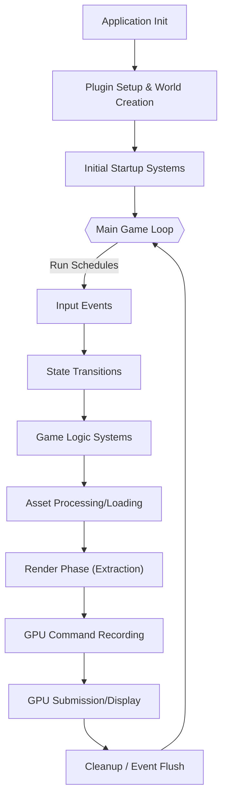

# 🚀 Bevy Engine

<p align="center"></p>

<p align="center">
    <a href="https://github.com/grewal16/bevy/stargazers"></a>
    <a href="https://github.com/grewal16/bevy/network/members"></a>
    <a href="https://github.com/grewal16/bevy/issues"></a>
    <a href="./LICENSE-MIT"></a>
</p>

## Short Description
Bevy is a refreshingly simple and powerful data-driven game engine built in Rust. It's designed for maximum productivity and performance, enabling developers to create stunning 2D and 3D games and interactive applications with ease, all while leveraging the safety and speed of modern Rust.

## 🛡️ Project Health & Status
Bevy is in active, robust development, backed by a thriving community. It features comprehensive CI/CD pipelines (`.github/workflows/`) for continuous testing, extensive benchmarking (`benches/`), and structured error handling (`errors/`), ensuring a stable and high-performance foundation. With a strong focus on reliability and developer experience, Bevy is becoming increasingly production-ready.

## ✨ Key Features
*   **Massively Parallel ECS:** A custom-built, high-performance Entity Component System for scalable and maintainable game logic.
*   **Flexible 2D & 3D Rendering:** PBR (Physically Based Rendering), global illumination (Solari), real-time reflections (SSR), screen-space ambient occlusion (SSAO), volumetric fog, motion blur, and advanced anti-aliasing (FXAA, SMAA, TAA, DLSS).
*   **Comprehensive Animation:** Skeletal animation, morph targets, and a powerful animation graph system for complex character and object motion.
*   **Intuitive UI System:** A declarative UI framework with responsive layout, gradients, box shadows, and a growing set of core widgets for rich user interfaces.
*   **Hot Asset Reloading:** Iterate rapidly with immediate feedback on asset changes during development.
*   **Cross-Platform Deployment:** First-class support for Desktop, Web (WASM), and Android, with ongoing iOS development.
*   **Built-in Developer Tools:** Diagnostics, gizmos for debugging, and a frame time graph for performance analysis.
*   **Modular Architecture:** Easily swap out or customize components to fit your project's unique needs.

## Who is this for?
Bevy is for game developers, hobbyists, and professional studios seeking a modern, open-source engine with a Rust-native codebase. It's also an excellent choice for creating high-performance simulations, interactive experiences, and graphical applications where performance, safety, and a vibrant community are paramount.

## Technology Stack & Architecture
Bevy is built entirely in **Rust**, leveraging its performance and safety guarantees.
*   **Core:** The engine's foundation is its custom **ECS (Entity Component System)**.
*   **Rendering:** Utilizes **WebGPU** via `wgpu` for cross-platform GPU access, with shaders written in **WGSL** and **GLSL**.
*   **Asset Pipeline:** Includes support for `gltf` for 3D models and `ron` (Recursive Object Notation) for custom asset serialization. Features advanced asset processing for optimized loading and decompression.
*   **Windowing:** Powered by `winit` for native window management across various platforms.
*   **Concurrency:** Employs `bevy_tasks` for efficient parallel task execution.

## 📊 Architecture & Database Schema
Bevy operates on a highly modular and data-driven architecture centered around its ECS. The core application loop processes data in a structured, parallel manner:


```mermaid
graph TD
    A["Application Init"] --> B["Plugin Setup & World Creation"];
    B --> C["Initial Startup Systems"];
    C --> D{{"Main Game Loop"}};
    D -- "Run Schedules" --> E["Input Events"];
    E --> F["State Transitions"];
    F --> G["Game Logic Systems"];
    G --> H["Asset Processing/Loading"];
    H --> I["Render Phase (Extraction)"];
    I --> J["GPU Command Recording"];
    J --> K["GPU Submission/Display"];
    K --> L["Cleanup / Event Flush"];
    L --> D;
```

## ⚙️ Configuration & Deployment
Bevy projects are configured using standard Rust `Cargo.toml` for dependencies and features. Build profiles (`.cargo/config_fast_builds.toml`) allow for optimized development and release builds.

*   **Desktop:** Standard `cargo run` and `cargo build` commands.
*   **Web (WASM):** Deployable to web browsers using `wasm-pack` and a basic `index.html`.
*   **Android:** Integrated Android project structure (`examples/mobile/android_example`) with `build.gradle` for native mobile deployment.
*   **CI/CD:** Automated testing and build workflows are configured via GitHub Actions.

## ⚡ Quick Start Guide
1.  **Install Rust:** If you don't have Rust installed, follow the instructions on [rustup.rs](https://rustup.rs/).
2.  **Create a new Bevy project:**
    ```bash
    cargo new my_bevy_game
    cd my_bevy_game
    ```
3.  **Add Bevy as a dependency** to `Cargo.toml`:
    ```toml
    [dependencies]
    bevy = "0.13" # Or the latest version
    ```
4.  **Write your first Bevy app** in `src/main.rs`:
    ```rust
    use bevy::prelude::*;

    fn main() {
        App::new()
            .add_plugins(DefaultPlugins)
            .add_systems(Startup, setup)
            .run();
    }

    fn setup(mut commands: Commands) {
        commands.spawn(Camera2dBundle::default());
        commands.spawn(SpriteBundle {
            sprite: Sprite {
                color: Color::rgb(0.25, 0.25, 0.75),
                custom_size: Some(Vec2::new(50.0, 50.0)),
                ..default()
            },
            ..default()
        });
    }
    ```
5.  **Run your application:**
    ```bash
    cargo run
    ```

## 📜 License
Bevy is dual-licensed under both **MIT** and **Apache 2.0** licenses, providing flexibility for your projects. You may choose either license for your use of the Bevy engine. See `LICENSE-MIT` and `LICENSE-APACHE` for full details.