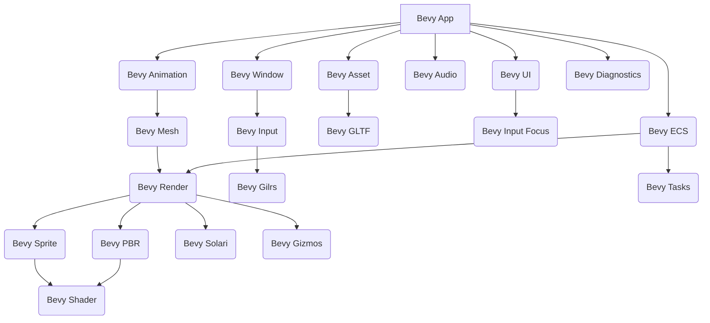

# 🚀 Bevy: A Data-Driven Game Engine

<p align="center"></p>

## Short Description
Bevy is a refreshingly simple and powerful data-driven game engine built in Rust. It's designed for maximum productivity and performance, offering a complete set of tools and a highly modular architecture for rapidly building games and interactive applications. Leveraging a custom Entity Component System (ECS) as its foundation, Bevy provides a flexible and efficient development experience, making it an excellent choice for both experienced game developers and newcomers to engine development.

## 🛡️ Project Health & Status
Bevy is in **Active Development** with a robust focus on stability, performance, and community contributions. The project maintains rigorous quality standards, featuring comprehensive CI/CD pipelines configured via `.github/workflows/ci.yml` that include automated testing, benchmarking, and code quality checks. This ensures a reliable and performant foundation for your projects.

## ✨ Key Features
*   **Powerful ECS Architecture:** A custom-built, highly optimized Entity Component System (ECS) for efficient game logic and data management.
*   **Flexible Rendering:** Full 2D and 3D rendering capabilities, including Physically Based Rendering (PBR), Sprites, and advanced post-processing effects like Bloom and Depth of Field.
*   **Comprehensive Asset Management:** A robust system for loading, managing, and hot-reloading assets, including support for glTF 3D models and various image/audio formats.
*   **Integrated UI System:** A declarative UI toolkit for building rich user interfaces, supporting responsive layouts, interaction states, and custom styling.
*   **Advanced Animation System:** Tools for complex animation graphs, blending, and morph targets to bring your characters and objects to life.
*   **Cross-Platform Deployment:** Support for a wide range of platforms, including desktop, web (WASM), and mobile (Android, iOS).
*   **Audio Engine:** Integrated audio playback and spatial audio capabilities.
*   **Developer Tools:** Built-in diagnostics, profiling, and gizmo-based debugging for rapid iteration and performance analysis.
*   **Modular Design:** A plug-in-based architecture that allows developers to easily extend or swap out core components to suit specific project needs.

## Who is this for?
Bevy is ideal for:
*   **Game Developers:** Seeking a modern, high-performance, and feature-rich engine for 2D and 3D game creation.
*   **Rustaceans:** Eager to build interactive applications and games using Rust's safety and performance guarantees.
*   **Graphics Enthusiasts:** Interested in exploring advanced rendering techniques and building custom pipelines.
*   **Engine Developers:** Looking for a well-structured, open-source engine to learn from or contribute to.

## Technology Stack & Architecture
Bevy is primarily built with **Rust**, leveraging Cargo for package management and Winit for cross-platform windowing. Its rendering backend utilizes **WGPU**, providing a modern, portable graphics API compatible with Vulkan, Metal, DX12, and WebGPU. Key serialization/deserialization tasks are handled by Serde, while asset processing supports formats like glTF and various image/audio codecs. The core strength lies in its custom ECS, delivering a highly optimized and performant runtime environment.

## 📊 Architecture & Database Schema

```mermaid
graph TD
    A[Bevy App] --> B(Bevy ECS)
    B --> C(Bevy Render)
    C --> D(Bevy PBR)
    C --> E(Bevy Sprite)
    D --> F(Bevy Shader)
    E --> F
    A --> G(Bevy Window)
    G --> H(Bevy Input)
    H --> I(Bevy Gilrs)
    A --> J(Bevy Asset)
    J --> K(Bevy GLTF)
    A --> L(Bevy UI)
    L --> M(Bevy Input Focus)
    A --> N(Bevy Audio)
    A --> O(Bevy Animation)
    O --> P(Bevy Mesh)
    P --> C
    B --> Q(Bevy Tasks)
    A --> R(Bevy Diagnostics)
    C --> S(Bevy Solari)
    C --> T(Bevy Gizmos)
```

## ⚙️ Configuration & Deployment
Bevy projects are built using Cargo. For local development, simply install the Rust toolchain and Cargo. For cross-platform deployment:
*   **Desktop:** Standard `cargo build --release` produces executables for your target OS.
*   **Web (WASM):** Use `wasm-pack` and a web server to deploy web builds.
*   **Mobile (Android/iOS):** Follow platform-specific guides leveraging tools like `cargo-apk` and Xcode, as hinted by `examples/mobile` configurations.
Performance-optimized builds are encouraged via `.cargo/config_fast_builds.toml` and release profiles.

## ⚡ Quick Start Guide
To get started with your own Bevy project:

1.  **Install Rust:** If you don't have Rust, install it via `rustup`:
    ```bash
    curl --proto '=https' --tlsv1.2 -sSf https://sh.rustup.rs | sh
    ```
2.  **Create a new Bevy project:**
    ```bash
    cargo new my_bevy_game
    cd my_bevy_game
    ```
3.  **Add Bevy as a dependency:** Add the following to your `Cargo.toml`:
    ```toml
    [dependencies]
    bevy = "0.12" # Use the latest version
    ```
4.  **Write your first Bevy app:** In `src/main.rs`, add a basic Bevy app:
    ```rust
    use bevy::prelude::*;

    fn main() {
        App::new()
            .add_plugins(DefaultPlugins)
            .add_systems(Startup, setup_camera)
            .add_systems(Update, hello_world_system)
            .run();
    }

    fn setup_camera(mut commands: Commands) {
        commands.spawn(Camera2dBundle::default());
    }

    fn hello_world_system() {
        info!("Hello, Bevy!");
    }
    ```
5.  **Run your app:**
    ```bash
    cargo run
    ```
    You should see "Hello, Bevy!" printed in your console and a blank Bevy window appear.

## 📜 License
This project is dual-licensed under both the **Apache License (Version 2.0)** and the **MIT License**. You may choose which license to use for your contributions and for consuming this project.
*   See [LICENSE-APACHE](./LICENSE-APACHE) for the Apache 2.0 License.
*   See [LICENSE-MIT](./LICENSE-MIT) for the MIT License.