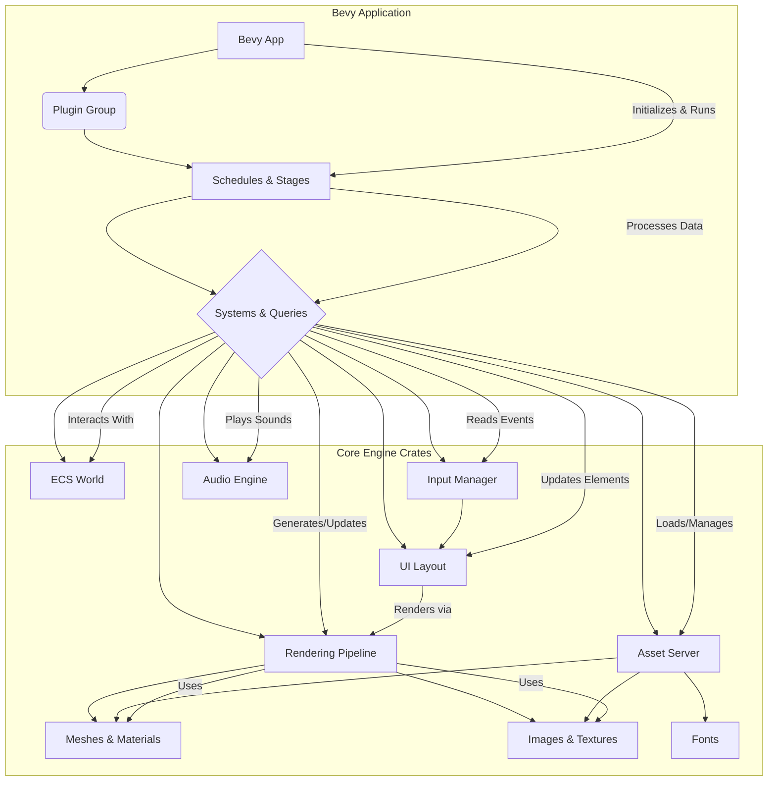

# 🚀 Bevy Engine

<p align="center"></p>

<p align="center">
  <a href="https://github.com/grewal16/bevy/stargazers"></a>
  <a href="https://github.com/grewal16/bevy/network/members"></a>
  <a href="https://github.com/grewal16/bevy/issues"></a>
  <a href="./LICENSE-MIT"></a>
</p>

## Short Description
Bevy is a refreshingly simple yet powerful data-driven game engine built in Rust. Designed for performance, modularity, and rapid development, Bevy empowers developers to create ambitious 2D and 3D games and applications with ease, leveraging a modern Entity Component System (ECS) architecture.

## ✨ Key Features
*   **ECS First:** A highly optimized, parallel-first Entity Component System forms the core, ensuring maximum performance and flexible architecture.
*   **2D & 3D Rendering:** Comprehensive rendering capabilities for both 2D sprites and complex 3D scenes, including advanced features like PBR, volumetric fog, and post-processing effects (Bloom, SSAO, SSR).
*   **Powerful Animation:** Built-in animation systems supporting skeletal animation, morph targets, and flexible animation graphs for dynamic in-game elements.
*   **Flexible UI System:** A declarative UI framework for building responsive user interfaces, supporting layout, gradients, and interaction states.
*   **Robust Asset Management:** An asynchronous asset loading and processing pipeline that handles diverse asset types like glTF models, images, fonts, and audio, with hot-reloading support.
*   **Cross-Platform Support:** Ready for deployment on desktop, web (WASM), and mobile (Android, iOS) platforms, enabling broad reach for your projects.
*   **Ergonomic Input Handling:** Intuitive APIs for keyboard, mouse, gamepad, and touch input, making game controls seamless.
*   **Diagnostic & Debugging Tools:** Integrated tools for performance monitoring (FPS overlay), visual gizmos, and detailed logging to streamline development.
*   **Modular & Extensible:** Designed as a collection of crates, allowing developers to pick and choose components or extend the engine's functionality with custom plugins and systems.

## Who is this for?
Bevy is ideal for game developers, hobbyists, and engine enthusiasts looking for a performant, modern, and open-source game engine. If you appreciate Rust's safety and speed, desire a data-driven architecture, and value modularity and community-driven development, Bevy is for you.

## Technology Stack & Architecture
Bevy is written entirely in **Rust**, a language renowned for its performance, memory safety, and concurrency. The rendering backend leverages **WebGPU** through `wgpu`, supporting modern graphics APIs across platforms. Shaders are primarily written in **WGSL** (WebGPU Shading Language), with support for **GLSL**. Asset formats like **glTF** are first-class citizens for 3D models. The engine's core architecture is a highly concurrent and flexible **Entity Component System (ECS)**, which is exposed directly to users, promoting efficient and organized game logic. The engine's functionality is distributed across many modular crates, promoting reusability and maintainability.

## 📊 Architecture & Database Schema


```mermaid
graph TD
    subgraph Bevy Application
        A[Bevy App] --> B(Plugin Group);
        B --> C[Schedules & Stages];
        C --> D{Systems & Queries};
    end

    subgraph Core Engine Crates
        D --> E[ECS World];
        D --> F[Rendering Pipeline];
        D --> G[Asset Server];
        D --> H[Input Manager];
        D --> I[Audio Engine];
        D --> J[UI Layout];
        F --> K[Meshes & Materials];
        F --> L[Images & Textures];
        G --> K;
        G --> L;
        G --> M[Fonts];
        H --> J;
    end

    A -- "Initializes & Runs" --> C;
    C -- "Processes Data" --> D;
    D -- "Interacts With" --> E;
    D -- "Generates/Updates" --> F;
    D -- "Loads/Manages" --> G;
    D -- "Reads Events" --> H;
    D -- "Plays Sounds" --> I;
    D -- "Updates Elements" --> J;
    F -- "Uses" --> K & L;
    J -- "Renders via" --> F;
```

## ⚡ Quick Start Guide

To get started with Bevy, ensure you have Rust installed. Then, clone the repository:

```bash
git clone https://github.com/grewal16/bevy.git
cd bevy
```

You can run any of the examples directly from the `examples` directory. For instance, to see a basic 3D scene:

```bash
cargo run --example 3d_scene
```

Or a 2D sprite animation:

```bash
cargo run --example sprite_animation
```

Explore the `examples/` directory for a wide range of functionalities and learn by doing!

## 📜 License
Bevy Engine is dual-licensed under both the **MIT License** and **Apache License (Version 2.0)**. You may choose either license to use this project. For full details, please see the [LICENSE-MIT](./LICENSE-MIT) and [LICENSE-APACHE](./LICENSE-APACHE) files in the repository root.