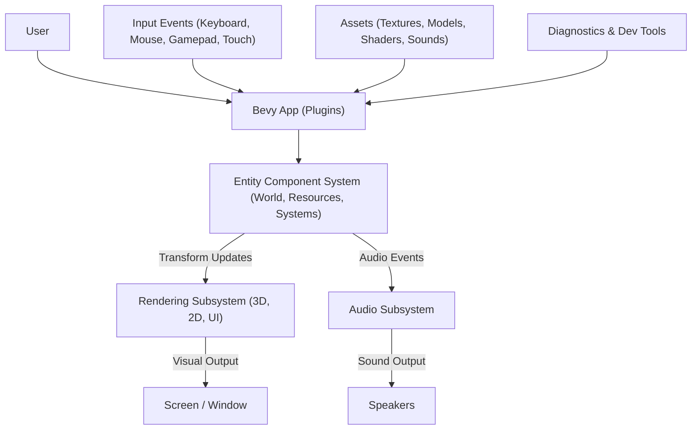

# 🚀 Bevy: The Refreshingly Simple Data-Driven Game Engine

<p align="center"></p>

## Short Description
Bevy is a powerful, yet elegantly simple, data-driven game engine built in Rust. Designed for productivity and performance, Bevy empowers developers to create ambitious 2D and 3D games and applications with a modern Entity Component System (ECS) architecture, fast iteration times, and a highly customizable rendering pipeline.

## ✨ Key Features
*   **Modern ECS Core:** A highly performant and flexible Entity Component System for managing game state and logic.
*   **Declarative & Modular:** Build applications with reusable plugins and systems, fostering a clear and scalable codebase.
*   **Stunning 2D & 3D Rendering:** Leverage PBR (Physically Based Rendering), advanced post-processing effects like Bloom, Depth of Field (DoF), Screen Space Ambient Occlusion (SSAO), and Screen Space Reflections (SSR), plus experimental Raytracing capabilities.
*   **Comprehensive Asset Management:** Load and hot-reload assets with ease, including support for GLTF 3D models, images (KTX2, DDS, HDR), audio (OGG), fonts, and custom asset types.
*   **Intuitive UI System:** Build responsive user interfaces with a flexible layout engine, gradients, and interactive widgets.
*   **Powerful Animation System:** Bring your characters and scenes to life with a versatile animation graph, morph targets, and skeletal animation.
*   **Cross-Platform Ready:** Develop for desktop, web (WebAssembly), and mobile (Android, iOS projects available in examples) with a unified codebase.
*   **Robust Input Handling:** Comprehensive support for keyboards, mice, gamepads, and touch input, including rumble functionality.
*   **Built-in Diagnostics & Dev Tools:** Monitor performance, debug issues, and visualize data with FPS overlays, frame time graphs, and picking debug tools.

## Who is this for?
Bevy is ideal for:
*   **Game Developers:** Seeking a performant, modular, and modern engine that gives them full control.
*   **Rust Enthusiasts:** Looking to build powerful applications and games leveraging Rust's safety and speed.
*   **Engine Hackers:** Who love to extend and customize every part of their development environment.
*   **Cross-Platform Creators:** Aspiring to deploy their projects across multiple platforms without extensive refactoring.

## Technology Stack & Architecture
Bevy is primarily written in **Rust**, a systems programming language known for its safety, speed, and concurrency. Its rendering pipeline leverages **WebGPU Shading Language (WGSL)** for defining shaders, ensuring modern, cross-platform GPU access. The project uses **Cargo** as its build system. For web and mobile development, **JavaScript/TypeScript** build scripts and native project configurations (e.g., Android's `CMakeLists.txt`, `build.gradle`, iOS `project.pbxproj`) are utilized to bridge Rust code with platform-specific environments.

## 📊 Architecture & Database Schema


```mermaid
graph TD
    User --> BevyApp["Bevy App (Plugins)"];
    BevyApp --> ECS["Entity Component System (World, Resources, Systems)"];
    ECS -- Transform Updates --> Rendering["Rendering Subsystem (3D, 2D, UI)"];
    ECS -- Audio Events --> Audio["Audio Subsystem"];
    Rendering -- Visual Output --> Display["Screen / Window"];
    Audio -- Sound Output --> Speakers["Speakers"];
    Input["Input Events (Keyboard, Mouse, Gamepad, Touch)"] --> BevyApp;
    Assets["Assets (Textures, Models, Shaders, Sounds)"] --> BevyApp;
    Diagnostics["Diagnostics & Dev Tools"] --> BevyApp;
```

## ⚡ Quick Start Guide

To get started with Bevy, ensure you have Rust installed via `rustup`.

1.  **Install Rust:**
    ```bash
    rustup update
    rustup override set stable
    ```

2.  **Create a New Bevy Project:**
    ```bash
    cargo new --bin my_bevy_game
    cd my_bevy_game
    ```

3.  **Add Bevy to `Cargo.toml`:**
    Add the following to your `Cargo.toml` under the `[dependencies]` section:
    ```toml
    [dependencies]
    bevy = "0.14" # Use the latest Bevy version
    ```

4.  **Run an Example (e.g., `hello_world.rs`):**
    To run one of Bevy's examples directly from the main repository (assuming you cloned Bevy itself):
    ```bash
    cargo run --example hello_world
    ```

## 📜 License
Bevy is dual-licensed under both **Apache License, Version 2.0** and **MIT License**. You may choose either license to use this project.

*   [LICENSE-APACHE](./LICENSE-APACHE)
*   [LICENSE-MIT](./LICENSE-MIT)