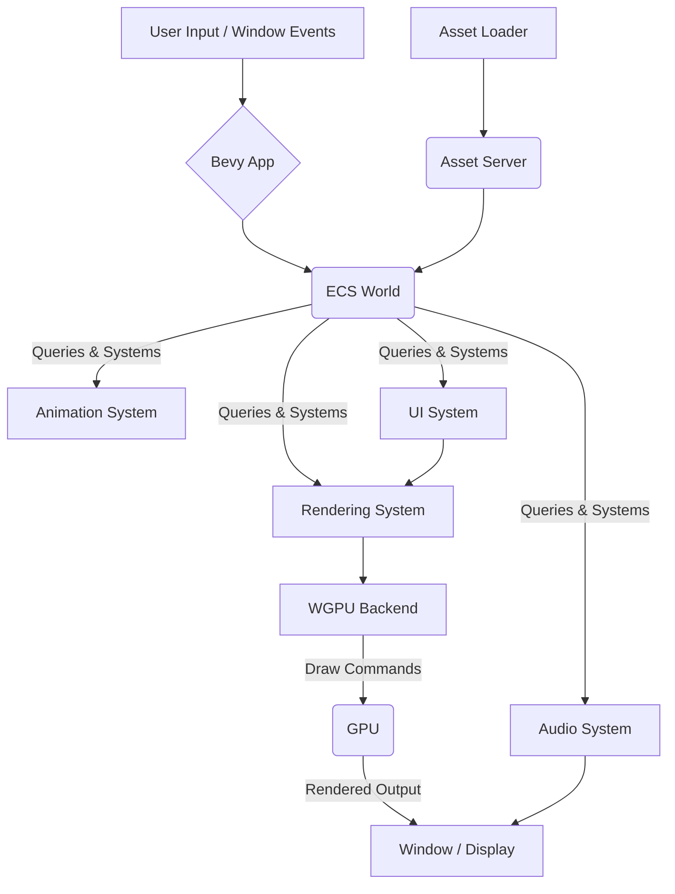

# 🚀 Bevy Engine

<p align="center"></p>

<p align="center">
  <a href="https://github.com/grewal16/bevy/stargazers"></a>
  <a href="https://github.com/grewal16/bevy/network/members"></a>
  <a href="https://github.com/grewal16/bevy/issues"></a>
  <a href="./LICENSE-MIT"></a>
</p>

## Short Description
Bevy is a refreshingly simple, yet powerful, data-driven game engine built in Rust. It's designed for maximum productivity and performance, leveraging a modular Entity Component System (ECS) architecture. From 2D sprites to complex 3D scenes with advanced rendering effects, Bevy provides a complete and extensible toolkit for crafting stunning interactive experiences across multiple platforms.

## 🛡️ Project Health & Status
Bevy is in active and robust development. A comprehensive Continuous Integration (CI) pipeline, including extensive tests and benchmarks, ensures code quality and performance. The presence of detailed issue templates and contribution guidelines further indicates a healthy, community-driven project with a strong focus on stability and continuous improvement.

## ✨ Key Features
*   **Powerful ECS Architecture:** Build games with a modern, data-oriented design.
*   **Versatile 2D & 3D Rendering:** Support for sprites, PBR materials, advanced lighting (point, directional, spot lights, lightmaps, irradiance volumes), screen-space effects (SSAO, SSR, volumetric fog), and customizable shaders.
*   **Comprehensive UI System:** Create interactive user interfaces with flexible layout and styling options.
*   **Animation System:** Keyframe animation for transforms, colors, and more, including advanced animation graphs and morph targets.
*   **Asset Management:** Robust loading and management for various asset types including GLTF models, images, fonts, and audio.
*   **Input Handling:** Supports keyboard, mouse, gamepad (via Gilrs), and touch inputs.
*   **Cross-Platform Capabilities:** Deploy to WebAssembly (WASM) and Android, with foundational support for other platforms.
*   **Developer Tools:** Built-in diagnostics, debug gizmos, and performance profiling tools.

## Who is this for?
Bevy is ideal for **game developers**, **interactive application creators**, and **Rust enthusiasts** who value performance, modularity, and a modern development approach. If you're looking for an open-source engine that puts you in control and fosters innovation, Bevy is for you.

## Technology Stack & Architecture
Bevy is entirely built in **Rust**, leveraging its performance and safety features.
*   **Core:** Bevy's foundation is its custom, high-performance **Entity Component System (ECS)**.
*   **Rendering:** Powered by **WGPU**, utilizing **WGSL** for its native shader language, with support for OpenGL ES (via feature flags).
*   **Windowing & Input:** Integrates with **Winit** for cross-platform window management and raw input, and **Gilrs** for gamepad support.
*   **Asset Loading:** Native asset pipeline supporting formats like GLTF, PNG, JPEG, OGG, TTF, and more.
*   **Build/Testing:** Uses Cargo as its build system, with Criterion for benchmarking and compile-fail tests for robust safety.

## 📊 Architecture & Database Schema

```mermaid
graph TD
    A[User Input / Window Events] --> B{Bevy App};
    B --> C(ECS World);
    C -- "Queries & Systems" --> D[Animation System];
    C -- "Queries & Systems" --> E[UI System];
    C -- "Queries & Systems" --> F[Audio System];
    C -- "Queries & Systems" --> G[Rendering System];
    G --> H[WGPU Backend];
    H -- "Draw Commands" --> I(GPU);
    I -- "Rendered Output" --> J[Window / Display];
    K[Asset Loader] --> L(Asset Server);
    L --> C;
    E --> G;
    F --> J;
```

## ⚙️ Configuration & Deployment
Bevy projects are configured using Rust's `Cargo.toml`. Build optimizations can be set in `.cargo/config_fast_builds.toml`. For platform-specific deployments:
*   **Android:** Refer to `examples/mobile/android_example` for native Android project setup with Gradle. Requires Android NDK.
*   **Web (WASM):** Use `examples/wasm` as a template for WebAssembly deployment, often involving `wasm-bindgen` and a web server.
*   **Linux:** Dependencies for development are managed via GitHub Actions in `.github/actions/install-linux-deps`.

## ⚡ Quick Start Guide
1.  **Install Rust:** If you don't have Rust installed, follow the instructions on [rustup.rs](https://rustup.rs/).
2.  **Clone the Repository:**
    ```bash
    git clone https://github.com/grewal16/bevy.git
    cd bevy
    ```
3.  **Run an Example:** Bevy comes with many examples to get started.
    ```bash
    cargo run --example 3d_scene
    ```
    To build for release with optimizations:
    ```bash
    cargo run --release --example 3d_scene
    ```
4.  **Create Your Own Project:** Create a new Rust project and add `bevy` as a dependency in `Cargo.toml`:
    ```toml
    [dependencies]
    bevy = "0.13" # Or the latest version
    ```

## 📜 License
Bevy is dual-licensed under both the **MIT License** and the **Apache License (Version 2.0)**.
You may choose either license to govern your use of Bevy.
See [LICENSE-MIT](./LICENSE-MIT) and [LICENSE-APACHE](./LICENSE-APACHE) for more details.