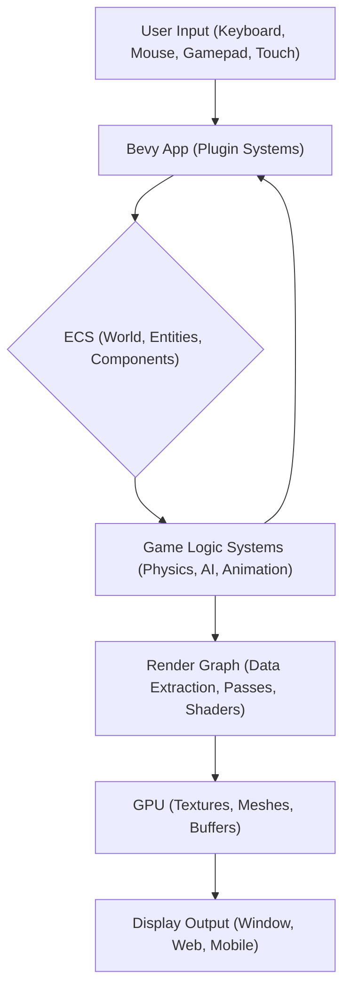

# 🚀 Bevy Engine

<p align="center"></p>

## Short Description
Bevy is a refreshingly simple and powerful data-driven game engine built in Rust. Designed for productivity, performance, and modularity, Bevy offers a robust Entity Component System (ECS) architecture, a flexible rendering pipeline, and seamless cross-platform deployment, empowering developers to create stunning 2D and 3D experiences.

## ✨ Key Features
*   **Data-Driven ECS:** A high-performance, parallel-friendly Entity Component System at its core for scalable game logic.
*   **Modular Architecture:** Everything from rendering to UI is a plug-and-play system, giving you ultimate control.
*   **Cutting-Edge Rendering:** Leverage advanced rendering techniques including Physical Based Rendering (PBR), Bloom, Depth of Field, SSAO, SSR, Meshlets, and Volumetric Fog.
*   **Cross-Platform Deployment:** Build and deploy your applications to Windows, macOS, Linux, Web (WASM), and Android from a single codebase.
*   **Hot Reloading:** Rapid iteration cycles with asset hot-reloading for textures, shaders, and even entire systems.
*   **Comprehensive Tooling:** Includes a robust asset management system, integrated UI framework, advanced input handling (keyboard, mouse, gamepad, touch), and powerful diagnostic tools.

## Who is this for?
Bevy is crafted for **game developers, graphics programmers, and interactive application creators** who value performance, flexibility, and a modern, Rust-native development experience. If you're looking for an engine that gets out of your way and allows you to build ambitious projects with clean, efficient code, Bevy is for you.

## Technology Stack & Architecture
Bevy is primarily written in **Rust**, leveraging its performance and memory safety guarantees. Its architecture revolves around a custom, highly optimized **Entity Component System (ECS)**.
The rendering backend is powered by **WebGPU** (via `wgpu`), allowing for modern, cross-platform graphics. Asset management is handled by an asynchronous pipeline, and native windowing is provided by `winit`.
Core dependencies also include `glam` for mathematics and `gilrs` for gamepad input, showcasing a commitment to a full-featured engine built on reliable, high-performance libraries.

## 📊 Architecture

```mermaid
graph TD
    A["User Input (Keyboard, Mouse, Gamepad, Touch)"] --> B["Bevy App (Plugin Systems)"];
    B --> C{"ECS (World, Entities, Components)"};
    C --> D["Game Logic Systems (Physics, AI, Animation)"];
    D --> B;
    D --> E["Render Graph (Data Extraction, Passes, Shaders)"];
    E --> F["GPU (Textures, Meshes, Buffers)"];
    F --> G["Display Output (Window, Web, Mobile)"];
```

## ⚡ Quick Start Guide
To get started with Bevy, you'll need the Rust toolchain installed.

1.  **Install Rust:** If you don't have Rust, install it via `rustup`:
    ```bash
    curl --proto '=https' --tlsv1.2 -sSf https://sh.rustup.rs | sh
    ```
2.  **Clone the Repository:**
    ```bash
    git clone https://github.com/grewal16/bevy.git
    cd bevy
    ```
3.  **Run an Example:** Try out one of the many examples to see Bevy in action. For instance, a basic 3D scene:
    ```bash
    cargo run --example 3d_scene --release
    ```
    Or a 2D sprite animation:
    ```bash
    cargo run --example sprite_animation --release
    ```

## 📜 License
Bevy is dual-licensed under both **MIT** and **Apache 2.0** licenses. You may choose either license to use the software. For more details, see the `LICENSE-MIT` and `LICENSE-APACHE` files in the repository root.