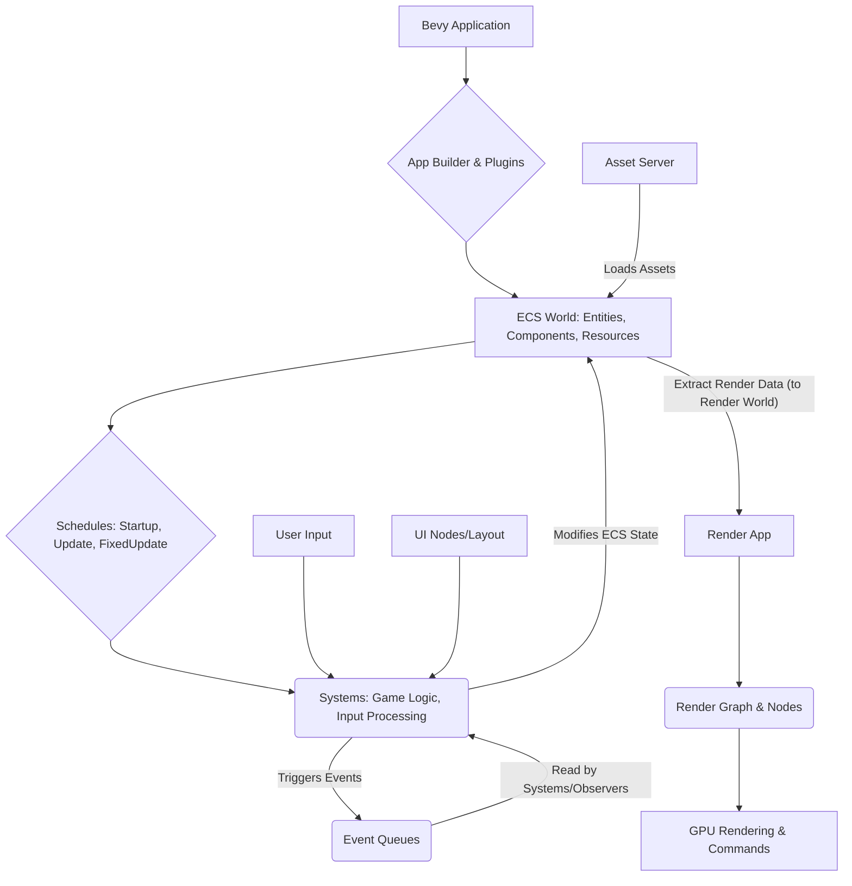

# 🚀 Bevy Engine

<p align="center"></p>

Unleash your creativity with Bevy, a refreshingly simple and powerful data-driven game engine built in Rust. Bevy is designed for rapid iteration and maximum flexibility, empowering you to build ambitious 2D and 3D applications with ease. Dive into a vibrant, open-source ecosystem, and experience a new paradigm in game development!

## Short Description
Bevy is a modern, modular, and data-driven game engine written in Rust. It features a custom Entity Component System (ECS) architecture, a flexible render graph, and a robust asset pipeline, making it ideal for creating high-performance games and interactive applications across multiple platforms.

## 🛡️ Project Health & Status
Bevy is in **active and robust development**, backed by a strong community and comprehensive continuous integration. Regular benchmarks and extensive testing suites, including unit, integration, and compile-fail tests (`tests/`, `benches/`, `tests-integration/`, `.github/workflows/ci.yml`), ensure high stability and performance. New features are constantly being added, while maintaining a strong focus on correctness and developer experience.

## ✨ Key Features
*   **Data-Driven ECS:** Leverage a highly optimized, parallelizable Entity Component System for clear, maintainable, and high-performance game logic.
*   **Flexible Renderer:** Power your visuals with a custom-built, plugin-driven rendering backend that supports PBR materials, advanced lighting, shadows, and cutting-edge post-processing effects like Bloom, SSAO, SSR, and volumetric fog.
*   **Realtime Raytracing (Bevy Solari):** Explore the future of graphics with experimental realtime pathtracing, including ReSTIR GI for stunning global illumination.
*   **Comprehensive Asset Management:** Load and manage diverse assets including GLTF models, various image formats (PNG, HDR, KTX2), audio (OGG), and custom scene definitions with built-in asset hot-reloading.
*   **Powerful UI System:** Build responsive user interfaces with a flexible UI framework powered by Taffy layout, supporting complex hierarchies, gradients, and interactive widgets.
*   **Animation System:** Bring your creations to life with a robust animation system, supporting animation graphs, skinned meshes, and morph targets.
*   **Cross-Platform:** Deploy your applications to Windows, macOS, Linux, Web (WASM), and Android from a single codebase.
*   **Developer Tools:** Accelerate your workflow with integrated tools like FPS overlays and picking debuggers.

## Who is this for?
Bevy is perfect for Rust developers who want a modern, high-performance, and extensible game engine. It caters to those who value a data-oriented design, strong parallelism, and the ability to customize every aspect of their engine without fighting complex abstractions. Whether you're building a 2D indie gem, a sprawling 3D world, or innovative interactive experiences, Bevy provides the tools you need.

## Technology Stack & Architecture
Bevy is built entirely in **Rust**, leveraging its performance and safety guarantees.
*   **Core Language:** Rust
*   **Rendering Backend:** WGPU (a WebGPU implementation) for cross-platform GPU access, compiling shaders via WGSL.
*   **Build System:** Cargo
*   **Math Library:** Glam
*   **UI Layout:** Taffy (Rust-native Flexbox implementation)
*   **Input Handling:** Integrates with Gilrs for gamepad support, and Winit for windowing events.
*   **Assets:** `.gltf`, `.glb` (3D Models), `.png`, `.hdr`, `.ktx2` (Images), `.ogg` (Audio), `.ron` (Custom Scenes/Animations).

## 📊 Architecture & Database Schema

```mermaid
graph TD
    A[Bevy Application] --> B{App Builder & Plugins};
    B --> C[ECS World: Entities, Components, Resources];
    C --> D{Schedules: Startup, Update, FixedUpdate};
    D --> E(Systems: Game Logic, Input Processing);
    E -- Modifies ECS State --> C;
    E -- Triggers Events --> F(Event Queues);
    F -- Read by Systems/Observers --> E;
    C -- "Extract Render Data (to Render World)" --> G[Render App];
    G --> H(Render Graph & Nodes);
    H --> I[GPU Rendering & Commands];
    J[Asset Server] -- Loads Assets --> C;
    K[User Input] --> E;
    L[UI Nodes/Layout] --> E;
```

## ⚙️ Configuration & Deployment
Bevy projects are configured using standard Rust `Cargo.toml` files. Platform-specific configurations are handled via Cargo features or environment variables. For mobile deployment, Android projects can be built using the provided example structures that integrate Rust code into native Android projects (`examples/mobile/android_example`). Web (WASM) deployment is supported out-of-the-box using `wasm-bindgen` and `wasm-pack`.

## ⚡ Quick Start Guide
To get started with Bevy, ensure you have Rust installed (via `rustup`).

1.  **Create a new Bevy project:**
    ```bash
    cargo new my_bevy_game
    cd my_bevy_game
    ```

2.  **Add Bevy as a dependency (in `Cargo.toml`):**
    ```toml
    [dependencies]
    bevy = "0.13" # Or the latest version
    ```

3.  **Write your first Bevy app (in `src/main.rs`):**
    ```rust
    use bevy::prelude::*;

    fn main() {
        App::new()
            .add_plugins(DefaultPlugins)
            .add_systems(Startup, setup)
            .run();
    }

    fn setup(mut commands: Commands) {
        // Add a 2D camera
        commands.spawn(Camera2dBundle::default());
        // Add a sprite
        commands.spawn(SpriteBundle {
            sprite: Sprite {
                color: Color::rgb(0.25, 0.25, 0.75),
                custom_size: Some(Vec2::new(50.0, 50.0)),
                ..default()
            },
            transform: Transform::from_xyz(0.0, 0.0, 0.0),
            ..default()
        });
        println!("Hello from Bevy!");
    }
    ```

4.  **Run your application:**
    ```bash
    cargo run
    ```

## 📜 License
This project is dual-licensed under both the **MIT License** and the **Apache License (Version 2.0)**. You may choose either license for your use of this software.
*   [LICENSE-MIT](./LICENSE-MIT)
*   [LICENSE-APACHE](./LICENSE-APACHE)